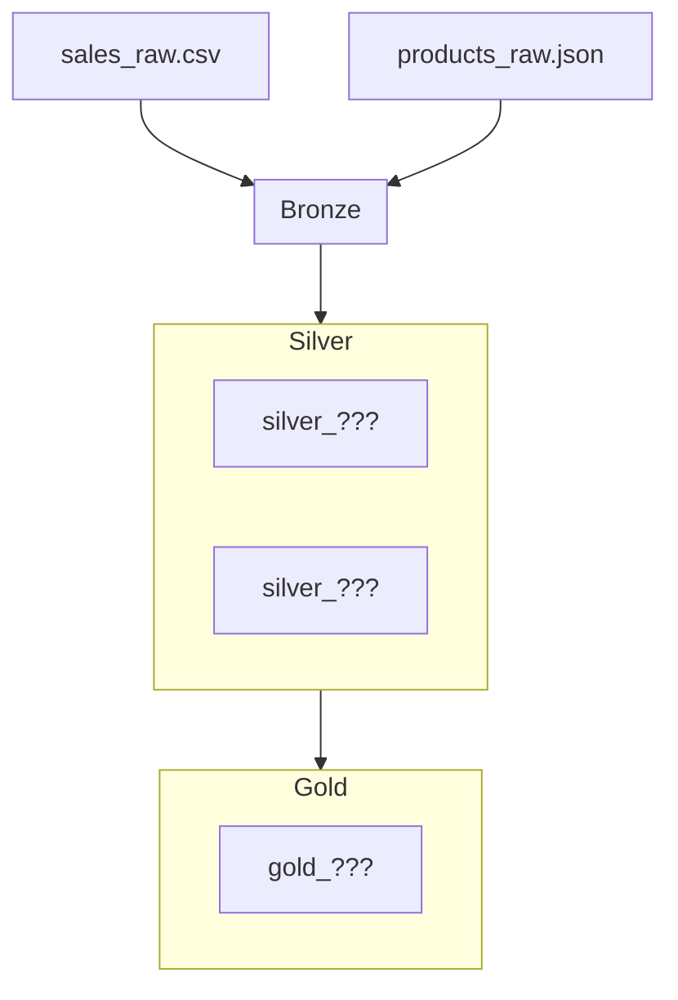

# Map the Pipeline

!!! abstract "B3: Quality focus that promotes continuous improvement utilising peer review techniques, innovation and creativity to the data system development process to improve processes and address business challenges."

## Your task

You have just heard about bronze, silver, and gold layers.
Now map the Day 2 HomeSphere pipeline onto that structure.

This is a design exercise - no code, no Fabric. Work on paper or in a shared doc.

---

## The three layers

| Layer | Purpose | Key rule |
|-------|---------|----------|
| **Bronze** | Raw data exactly as it arrived | Never modified after landing |
| **Silver** | Cleaned, standardised, validated | Trustworthy - safe to share |
| **Gold** | Business-facing output | Built from silver, answers a specific question |

---

## What exists in Day 2

Work through each item below and assign it to bronze, silver, or gold.
If it does not fit cleanly, note why.

| Item | Where it should live | Notes |
|------|---------------------|-------|
| `sales_raw.csv` | | |
| `products_raw.json` | | |
| `cleaned_sales` table | | |
| `sales_trusted` table | | |
| The cleaning logic (strip £, parse dates, etc.) | | |
| The join logic | | |
| The `line_value` calculation | | |
| The revenue-by-category groupby | | |

---

## What is missing?

After mapping what exists, discuss what the medallion structure reveals is absent:

- Is there a silver Products table? Should there be?
- Is there any validation between bronze and silver?
- Is the gold layer explicitly labelled, or is it just another table with an unclear name?
- Where does bronze end and silver begin in the current pipeline?

---

## Sketch the target

Draw what the HomeSphere pipeline should look like after Day 3, as a mermaid diagram:

Fill in the table names. These will be what you build in the afternoon.
