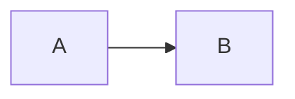
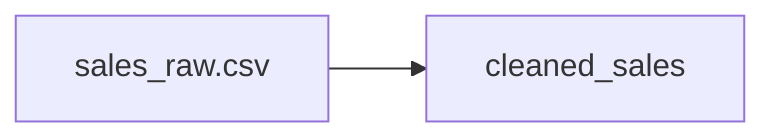
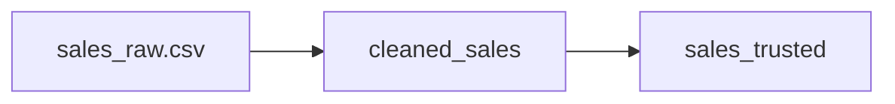
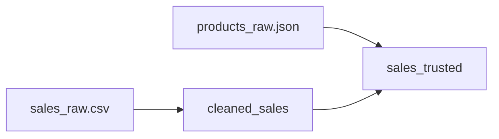
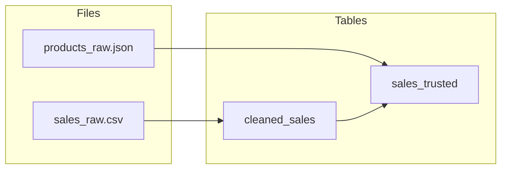

# Creating Diagrams with Mermaid

## 1. Mermaid turns text into a diagram

Show this:

```text
flowchart LR
    A --> B
```


!!! note "Mermaid is just text. The arrows describe relationships. No drawing tool needed."

## 2. Nodes need meaningful labels

```text
flowchart LR
    Raw[sales_raw.csv] --> Clean[cleaned_sales]
```


```text
Raw is the internal name
[sales_raw.csv] is what appears on the diagram
```

## 3. One arrow per relationship

The Day 2 pipeline is two notebooks, one after the other. Chain it:

```text
flowchart LR
    Raw[sales_raw.csv] --> Clean[cleaned_sales]
    Clean --> Trusted[sales_trusted]
```


## 4. A node can have more than one input

`sales_trusted` is not just `cleaned_sales` carried forward - the second notebook joins in the product data too:

```text
flowchart LR
    Raw[sales_raw.csv] --> Clean[cleaned_sales]
    Products[products_raw.json] --> Trusted[sales_trusted]
    Clean --> Trusted
```


!!! question "QUESTION: Looking at this diagram, where do raw files and cleaned tables actually live? The diagram does not say - yet."

## 5. Subgraphs group nodes that belong together

`sales_raw.csv` and `products_raw.json` both live in Files. `cleaned_sales` and `sales_trusted` both live in Tables. Group them:

```text
flowchart LR
    subgraph Files
        Raw[sales_raw.csv]
        Products[products_raw.json]
    end

    subgraph Tables
        Clean[cleaned_sales]
        Trusted[sales_trusted]
    end

    Raw --> Clean
    Products --> Trusted
    Clean --> Trusted
```


This is the Day 2 pipeline, as a diagram, in six lines of text - no drawing tool, no click-and-drag.

!!! info "Mermaid also renders natively in GitHub `.md` files and in HedgeDoc - useful later when you are building your own diagrams."
