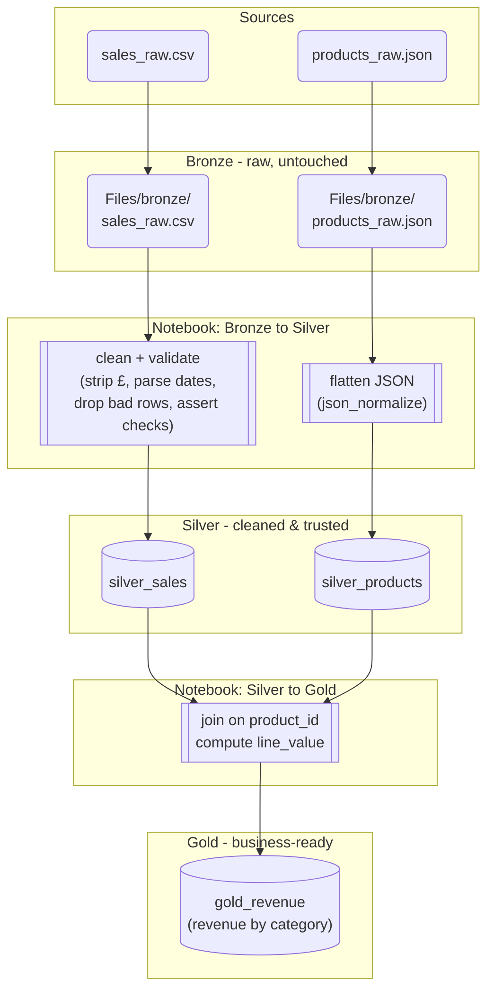

# HomeSphere Pipeline - Target Architecture

This is what you build in Lab 3.1 this afternoon.

```mermaid
flowchart TB
    subgraph SRC["Sources"]
        CSV("sales_raw.csv")
        JSON("products_raw.json")
    end

    subgraph BRZ["Bronze - raw, untouched"]
        BCSV("Files/bronze/\nsales_raw.csv")
        BJSON("Files/bronze/\nproducts_raw.json")
    end

    subgraph NB1["Notebook: Bronze to Silver"]
        CLEAN[["clean + validate\n(strip £, parse dates,\ndrop bad rows, assert checks)"]]
        FLAT[["flatten JSON\n(json_normalize)"]]
    end

    subgraph SIL["Silver - cleaned & trusted"]
        SS[("silver_sales")]
        SP[("silver_products")]
    end

    subgraph NB2["Notebook: Silver to Gold"]
        JOIN[["join on product_id\ncompute line_value"]]
    end

    subgraph GLD["Gold - business-ready"]
        GR[("gold_revenue\n(revenue by category)")]
    end

    CSV --> BCSV
    JSON --> BJSON
    BCSV --> CLEAN
    BJSON --> FLAT
    CLEAN --> SS
    FLAT --> SP
    SS --> JOIN
    SP --> JOIN
    JOIN --> GR
```
