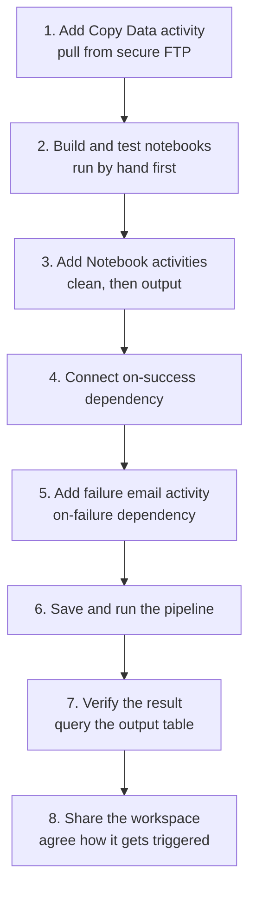

# HomeSphere Pipeline - Deployment Guide

**Platform:** Microsoft Fabric

---

### Deployment steps

1. **Add a Copy Data activity** to the pipeline that pulls the raw files from the source's secure FTP site into `Files/bronze/`, using a saved Fabric connection rather than someone uploading files by hand.
2. **Build and test** the clean and output logic as separate notebooks first, running them by hand to confirm each one works on its own.
3. **Add a Notebook activity** for the clean step and a second Notebook activity for the output step, connected after the Copy Data activity.
4. **Connect them with an *on success* dependency**, so the output step only runs if the clean step completes without errors - this is what makes it more reliable than running notebooks by hand.
5. **Add an Office 365 Outlook activity** connected via an *on failure* dependency from the Copy Data activity and each notebook activity, so the team gets an email the moment any step fails - not silence until someone happens to check.
6. **Save and run the pipeline**, watching the Monitor/Output pane until all activities show as succeeded.
7. **Verify the result** by querying the output table directly, rather than assuming success from a green tick alone.
8. **Share the workspace** with the team who will run or maintain it, with the right role (not full admin by default), and agree how the pipeline gets triggered going forward - manually for now, scheduled later.

---

### Security

- Access to the workspace is controlled through Fabric workspace roles - Viewer for people who only query `gold_revenue`, Contributor for people running notebooks.
- FTP credentials are stored in a Fabric connection, not hard-coded in the pipeline or notebooks - only people with access to the connection can see or change them.
- The FTP transfer itself runs over a secure protocol (SFTP/FTPS) rather than plain FTP, so credentials and file contents are not sent in the clear.
- Data at rest is stored in OneLake, covered by the organisation's existing Microsoft 365 security policy - nothing bespoke was configured for this pipeline.

---

### Scalability

- Current volumes are tiny (tens of rows) - the notebooks would need testing against realistic volumes before this goes near production data.
- Pulling from FTP removes the manual-upload bottleneck, but the Copy Data activity still copies the whole file each run - that becomes the next limit as file size grows.
- If source data grew significantly, the next step would be incremental loads instead of reprocessing the full file each run, not just pointing the same notebooks at bigger files.

---

### Governance

- The Data Engineering team owns the pipeline; ownership is noted in the handover artefact from this morning's session.
- Known limitations (no row count alerting, no run history, manual trigger) are documented rather than hidden - see the handover note.
- No formal retention or compliance rules apply yet, since this is a training pipeline - a real deployment would need this section to name actual policies (e.g. how long raw files are kept, who can request deletion).

---

