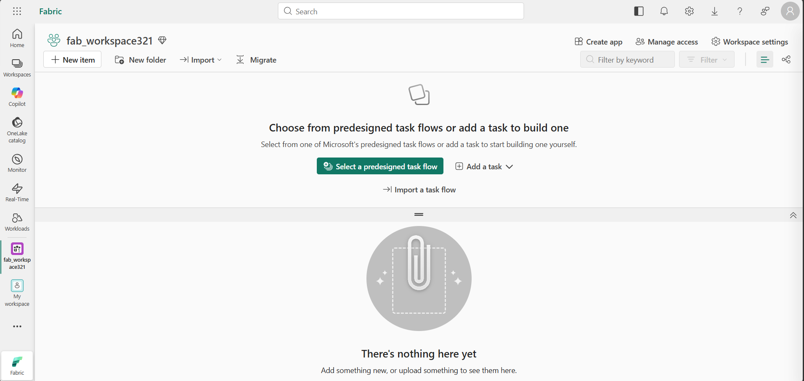
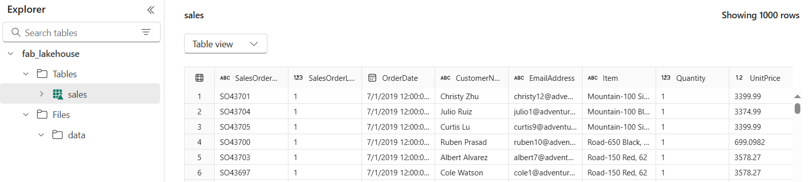
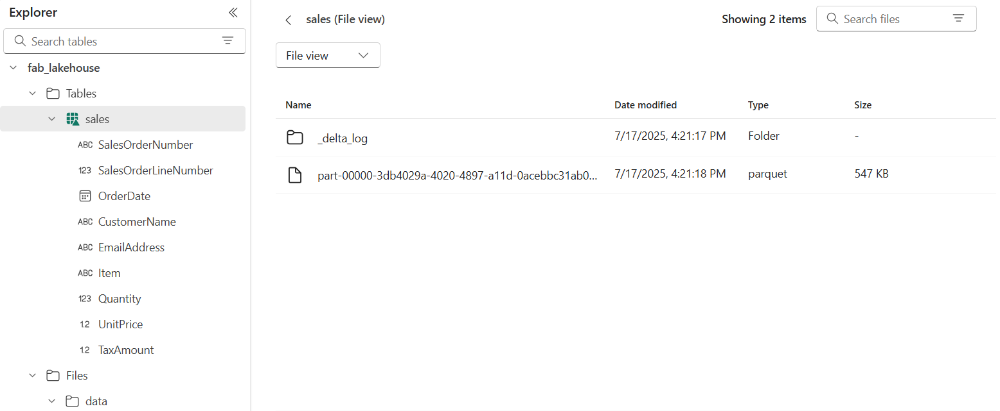
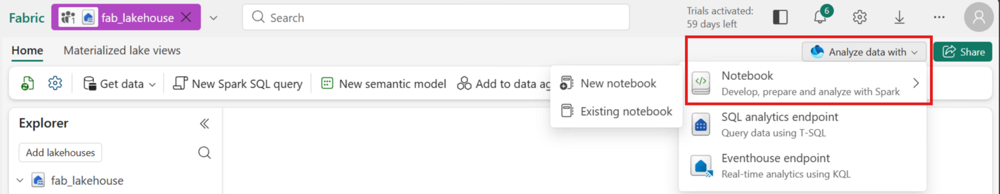
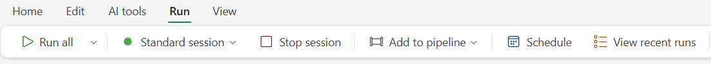
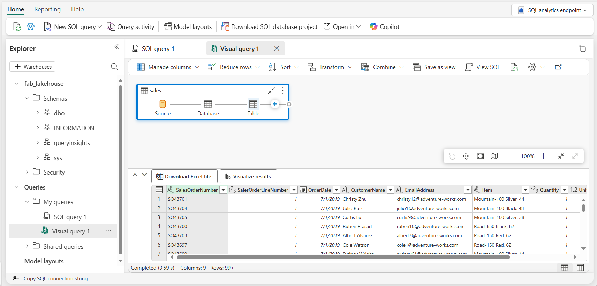
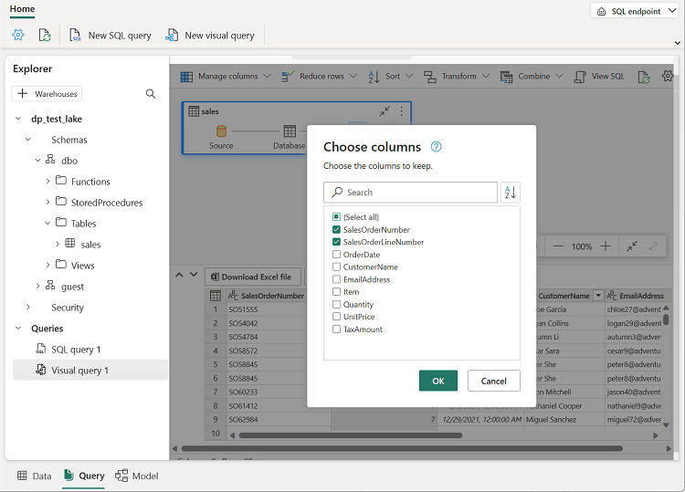
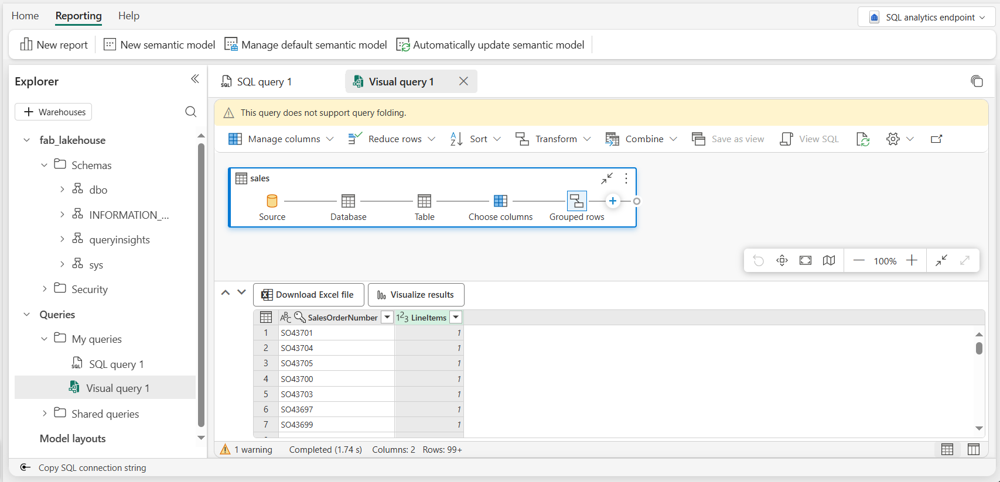

# Lab 2.1 ~ Create a Microsoft Fabric Lakehouse

In this lab you will create a Microsoft Fabric lakehouse, upload data, and explore how files and tables work in OneLake. You will also query the data using a notebook, SQL, and the visual query editor.


## Step 1: Start the Microsoft Fabric Playground

1. Navigate to the [QA Platform](https://bud.sso.app.qa.com/lab/microsoft-fabric-playground/) to access the **Microsoft Fabric Playground**.

2. Click **Start** to start the lab.

3. Make a note of your allocated **username** and **password**.

!!! warning "Wait until the lab status shows **Ready**, before continuing with the next step!"

!!! tip "Switch to your Virtual Machine to complete the steps listed below."


## Step 2: Logon to Azure and Microsoft Fabric

1. In your VM open a **private browsing window** (InPrivate in Edge, Incognito in Chrome).

2. Navigate to the [Microsoft Azure home page](https://portal.azure.com/) at: https://portal.azure.com

3. When prompted, sign in using:

    - **Username** from the QA Platform (used as the email address)
    - **Password** from the QA Platform (used as a Temporary Access Pass)

    - If prompted to "Stay signed in?", select **No**.

    !!! success "You are now signed in to the **Azure portal**. This confirms your lab account is active."

4. In the same private browsing window, **open a new tab**.

5. Navigate to the [Microsoft Fabric home page](https://app.fabric.microsoft.com/home?experience=fabric-developer) at: https://app.fabric.microsoft.com/home?experience=fabric-developer

6. If prompted, **re-enter your email address** to confirm access to Microsoft Fabric.

    !!! quote ""
        


## Step 3: Create a workspace

Before working with data in Fabric, you need to create a workspace.

1. In the navigation pane on the left, select **Workspaces** (the icon looks similar to &#128455;).

2. Select **+ New workspace**, then create a workspace using the naming format below:

    - Start the name with `fab_workspace`
    - Add random numbers to make it unique (for example, `fab_workspace123`)
    - Leave all other options as the default values
    - Click **Apply**

3. Your workspace should be empty, and look similar to this:

    !!! quote ""
        


## Step 4: Create a lakehouse

Now that you have a workspace, it's time to create a data lakehouse into which you'll ingest data.

1. On the menu bar on the left, select **Create**. In the *New* page, under the *Data Engineering* section, select **Lakehouse**.

    - Name the lakehouse `fab_lakehouse`
    - Leave **Lakehouse schemas** selected.

    !!! tip "If the **Create** option is not pinned to the sidebar, you need to select the ellipsis (…) option first."

    After a minute or so, a new empty lakehouse will be created.

    !!! quote ""
        

2. View the new lakehouse, and note that the **Lakehouse explorer** pane on the left enables you to browse tables and files in the lakehouse:

    - The **Tables** folder contains tables that you can query using SQL semantics. Tables in a Microsoft Fabric lakehouse are based on the open source *Delta Lake* file format, commonly used in Apache Spark.

    - The **Files** folder contains data files in the OneLake storage for the lakehouse that aren't associated with managed delta tables. You can also create *shortcuts* in this folder to reference data that is stored externally.

Currently, there are no tables or files in this lakehouse.


## Step 5: Create a subfolder and upload a file

Fabric provides multiple ways to load data into the lakehouse. One of the simplest ways to ingest small amounts of data is to upload files directly.

1. In the **Explorer** pane of the lakehouse, click the **...** menu for the **Files** folder and select **New subfolder**.

    - Name the new subfolder: `data`
    - Click **Create**

2. Locate the `sales.csv` file in the `data` directory on your Virtual Machine.

    - If the file is not there, download it from: https://raw.githubusercontent.com/qaalabs/fabric/refs/heads/main/data/sales.csv

    !!! note
        To download the file, open a new tab in the browser and paste in the URL. Right click anywhere on the page and select **Save as** to save the data as a CSV file.

3. In the **...** menu for the **data** folder, select **Upload** and **Upload files**.

    - Upload the `sales.csv` file.

4. Select the `data` folder and verify that `sales.csv` has been uploaded:

    !!! quote ""
        

5. Select the `sales.csv` file to see a preview of its contents.

    !!! tip "If **sales.csv** does not automatically appear, in the **...** menu for the **data** folder, select **Refresh**."

    !!! note "Make sure the file has a `.csv` extension - not `.txt`"


## Step 6: Load file data into a table

The sales data you uploaded is in a file. Loading it into a table lets you query it using SQL.

1. In the **Explorer** pane, select the **Files/data** folder so you can see the `sales.csv` file it contains.

2. In the **...** menu for the `sales.csv` file, select **Load to Tables** > **New table**.

    !!! quote ""
        

3. In the **Load to table** dialog box:

    - Make sure that the new table name is: `sales`
    - Column header should be selected, and separator should be a comma.
    - Click **Load**.

    Wait for the table to be created and loaded.

    !!! tip "If the `sales` table does not automatically appear, in the **...** menu for the **Tables** folder, select **Refresh**."

4. In the **Explorer** pane, select the `sales` table to view the data:

    !!! quote ""
        

5. In the **...** menu for the `sales` table, select **View files** to see the underlying files for this table:

    !!! quote ""
        

    !!! info ""
        Files for a delta table are stored in *Parquet* format, and include a subfolder named `_delta_log` in which details of transactions applied to the table are logged.


## Step 7: Use a notebook to query tables

Fabric notebooks let you write and run code directly against your lakehouse tables using Apache Spark.

1. On the **Home** tab of your lakehouse, select **Open notebook** > **New notebook**.

    If the option is not on the Home tab then at the top-right of the Lakehouse page:

    - Select **Analyze data with** dropdown and choose: **Notebook** > **New notebook**

    !!! quote ""
        

2. Then in the notebook menu bar, use the ⚙️  **Settings** icon to view the notebook settings.

    - Set the **Name** of the notebook to: `Explore Sales`
    - Close the settings pane to save the changes.

3. In the first cell, enter the following code to load and display the sales table:

    ```python
    df = spark.read.table("sales")
    display(df)
    ```

4. Use the :material-play: **(Run cell)** button to run the cell.

    - It will take a moment to start the Spark session the first time.

    !!! warning "If you see an `InvalidHttpRequest [TooManyRequestsForCapacity]` error:"
        The **View files** action in the previous step may have left a Spark session running in the background. To fix this:

        - In the left navigation bar, select **Monitor**
        - Find any activity that is still running and cancel it
        - Return to your notebook and run the cell again

    !!! success "The sales table should be displayed as an interactive grid below the cell."

5. Below the interactive grid, click **+ Code** to add a new code cell, and enter the following code to calculate revenue by item:

    ```python
    from pyspark.sql.functions import col, sum, round

    revenue = (df.groupBy("Item")
                 .agg(round(sum(col("Quantity") * col("UnitPrice")), 2).alias("Revenue"))
                 .orderBy("Revenue", ascending=False))

    display(revenue)
    ```

6. Run the new cell and review the results.

7. After exploring the notebook, select the **Run** tab above the ribbon and select **Stop session**.

    !!! quote ""
        


## Step 8: Use SQL to query tables

A SQL analytics endpoint is automatically created when you define tables in a lakehouse, allowing you to query them using standard SQL.

1. In the left navigation bar, return to your lakehouse `fab_lakehouse`.

2. At the top-right of the Lakehouse page, select **Analyze data with** and choose **SQL analytics endpoint**.

    - Wait a short time until the SQL analytics endpoint opens.

2. Use the **New SQL query** button to open a new query editor, and enter the following SQL query:

    ```sql
    SELECT Item, SUM(Quantity * UnitPrice) AS Revenue
    FROM sales
    GROUP BY Item
    ORDER BY Revenue DESC;
    ```

3. Use the :material-play: **Run** button to run the query and view the results.

    !!! quote ""
        

    !!! success "You should see the same revenue totals per item that you saw in the notebook."


## Step 9: Create a visual query

Those with Power BI experience can apply their Power Query skills to create visual queries.

1. On the toolbar of `fab_lakehouse`, expand the **New SQL query** option and select **New visual query**.

2. Drag the `sales` table to the new visual query editor pane:

    !!! quote ""
        

3. In the **Manage columns** menu, select **Choose columns**.

    - Select only the **SalesOrderNumber** and **SalesOrderLineNumber** columns. Click **OK**.

    !!! quote ""
        

4. In the **Transform** menu, select **Group by**. Then group the data using the following **Basic** settings:

    - **Group by**: SalesOrderNumber
    - **New column name**: `LineItems`
    - **Operation**: Count distinct values
    - **Column**: SalesOrderLineNumber

    The results pane shows the number of line items for each sales order.

    !!! quote ""
        

---

## Clean up resources

In this exercise, you created a lakehouse and imported data into it. You explored how a lakehouse consists of files and tables stored in OneLake, and how managed tables can be queried using SQL.

Once you've finished exploring your lakehouse, you should delete the workspace you created for this exercise.

1. Navigate to Microsoft Fabric in your browser.

2. In the bar on the left, select the icon for your workspace to view all of the items it contains.

3. Select **Workspace settings** and in the **General** section, scroll down and select **Remove this workspace**.

4. Select **Delete** to delete the workspace.
