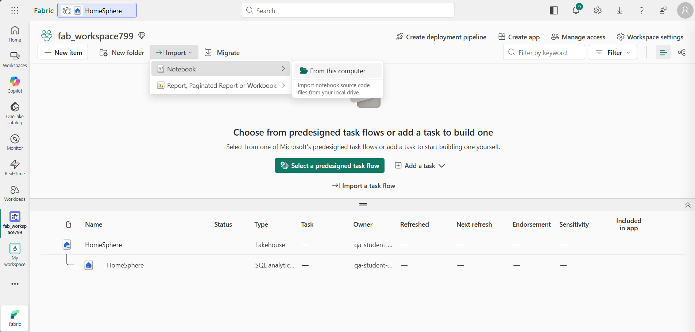

# Lab 2.2 ~ Set Up the HomeSphere Environment

!!! info "This lab continues from Lab 2.1. You should already be signed in to Microsoft Fabric."

## Step 1: Create a workspace

Before working with data in Fabric, you need to create a workspace.

1. In the navigation pane on the left, select **Workspaces** (the icon looks similar to &#128455;).

2. Select **+ New workspace**, then create a workspace using the naming format below:

    - Start the name with `fab_workspace`
    - Add random numbers to make it unique (for example, `fab_workspace123`)
    - Leave all other options as the default values
    - Click **Apply**

3. Your workspace should be empty, and look similar to this:

    !!! quote ""
        

## Step 2: Create a lakehouse

Now that you have a workspace, it's time to create a lakehouse for the HomeSphere data.

1. On the menu bar on the left, select **Create**. In the *New* page, under the *Data Engineering* section, select **Lakehouse**.

    - Name the lakehouse `HomeSphere`
    - Leave **Lakehouse schemas** selected.

    !!! tip "If the **Create** option is not pinned to the sidebar, you need to select the ellipsis (…) option first."

    After a minute or so, a new empty lakehouse will be created.

    !!! quote ""
        

## Step 3: Upload the HomeSphere data files

With the lakehouse created, you can now upload the HomeSphere source data files.

1. In the **Explorer** pane of the lakehouse, click the **...** menu for the **Files** folder and select **New subfolder**.

    - Name the new subfolder: `data`
    - Click **Create**

2. Locate the following files in the `HomeSphere/data/` folder on your Desktop:

    - `sales_raw.csv`
    - `products_raw.json`

    !!! tip "If you cannot find the `HomeSphere` folder, you may need to re-run the `git clone` command."

3. In the **...** menu for the `data` folder, select **Upload** and **Upload files**.

    - Upload both `sales_raw.csv` and `products_raw.json`.

4. Select the `data` folder and confirm both files are visible.

    !!! tip "If the files do not automatically appear, in the **...** menu for the `data` folder, select **Refresh**."

## Step 4: Import the notebooks

The HomeSphere notebooks contain the code for cleaning and transforming the data. You will import them into your workspace now, ready for the next lab.

1. In the left navigation bar, select your workspace name to return to the workspace view.

2. On the toolbar select **Import** and choose **Notebook**. Then select **From this computer**.

    !!! quote ""
        

3. Browse to the `HomeSphere/cloud/` folder on your Desktop and import these two notebooks:

    - `cloud_clean.ipynb`
    - `cloud_output.ipynb`

4. Select **Import** again - this time browse to the `HomeSphere/solution/` folder and import:

    - `cloud_clean_solution.ipynb`
    - `cloud_output_solution.ipynb`

!!! success "All four notebooks should now appear as items in your workspace."

## Step 5: Attach the lakehouse to the notebooks

Opening each notebook from within the lakehouse connects it to the HomeSphere data automatically.

1. In the left navigation bar, return to your lakehouse `HomeSphere`.

2. On the **Home** tab:

    - Select **Open notebook** > **Existing notebook**
    - Choose `cloud_clean`

3. In the **Notebook Explorer** on the left, select **Data Items**.

    !!! success "**HomeSphere** should be listed under **OneLake** - the lakehouse is now attached to this notebook."

4. Return to the lakehouse and repeat for `cloud_output`:

    - Select **Open notebook** > **Existing notebook**
    - Choose `cloud_output`

5. Select **Data Items** in the Notebook Explorer and confirm that **HomeSphere** appears under **OneLake**.

!!! success "Both notebooks are now connected to the HomeSphere lakehouse and ready for the next lab."

---

## Keep your workspace

In this exercise, you have created the HomeSphere lakehouse, uploaded the source data files, and imported the notebooks.

**Do not delete your workspace** - you will continue working in it in the next lab.

