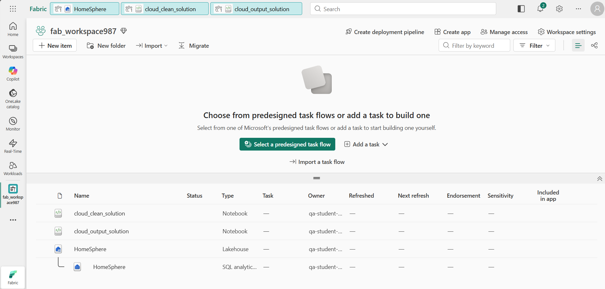

# Lab 25 ~ Orchestrate the HomeSphere ETL with a Pipeline

!!! info "For this lab, you will access the QA Platform and sign in using the credentials provided."

!!! warning "You must use an incognito or private browser window to avoid conflicts with any work or personal Microsoft accounts you may already be signed in to."


## Step 1: Access Microsoft Fabric

In this lab, you will access Microsoft Fabric using a temporary lab account provided by the QA Platform.

!!! note
    The QA Platform opens the Azure portal by default. This is expected. Microsoft Fabric is a separate portal, even though it uses the same Microsoft account.

1. In the QA Platform, wait until the lab status shows **Ready**.

2. Then right-click **Open** and choose **Open in a private browsing window** (InPrivate in Edge, Incognito in Chrome).

3. When prompted, sign in using:

    - **Username** from the QA Platform (used as the email address)
    - **Password** from the QA Platform (used as a Temporary Access Pass)

    - If prompted to "Stay signed in?", select **No**. This ensures the session ends when the private window is closed.

    !!! success "You are now signed in to the **Azure portal**. This confirms your lab account is active."

4. In the same private browsing window, **open a new tab**.

5. Navigate to the [Microsoft Fabric home page](https://app.fabric.microsoft.com/home?experience=fabric-developer) at: https://app.fabric.microsoft.com/home?experience=fabric-developer

6. If prompted, **re-enter your email address** to confirm access to Microsoft Fabric. This check verifies that a Fabric licence has been assigned to your lab account.

7. After confirmation, you should be redirected to the **Microsoft Fabric home page**:

    !!! quote ""
        


## Step 2: Return to your HomeSphere workspace

This lab continues from where you left off. Your workspace and lakehouse from the earlier session are still available.

1. In the navigation pane on the left, select **Workspaces** (the icon looks similar to &#128455;).

2. Select your `fab_workspace` to open it.

    !!! tip "If your workspace is no longer available, you will need to repeat the setup steps from Lab 22 before continuing."


## Step 3: Attach the solution notebooks to the lakehouse

You imported four notebooks in Lab 22. So far you have only used the exercise notebooks. In this lab you will use the solution notebooks to build your pipeline.

1. In the left navigation bar, select your **HomeSphere** lakehouse.

2. On the **Home** tab, select **Open notebook** > **Existing notebook**, and choose `cloud_clean_solution`.

3. In the **Notebook Explorer** on the left, select **Data Items** and confirm that **HomeSphere** appears under **OneLake**.

4. Return to the lakehouse and repeat for `cloud_output_solution` - select **Open notebook** > **Existing notebook** and choose `cloud_output_solution`.

5. Confirm that **HomeSphere** also appears under **Data Items** in the Notebook Explorer.

    !!! success "Both solution notebooks are now connected to the HomeSphere lakehouse."


## Step 4: Create a pipeline

A pipeline lets you orchestrate the two notebooks so they run in sequence automatically, rather than being triggered manually one at a time.

1. In the left navigation bar, select your workspace name to return to the workspace view.

    !!! quote ""
        

2. Select **New item**, then search for and select **Pipeline**.

3. Name the pipeline: `HomeSphere ETL Pipeline`

    !!! success "The pipeline designer canvas should open, ready for you to add activities."


## Step 5: Configure the pipeline activities

You will add two Notebook activities - one for each solution notebook - and connect them so that the output notebook only runs after the clean notebook has succeeded.

1. In the pipeline canvas **start with a blank canvas**:

    - Select **Pipeline activity**
    - Choose **Notebook** (scroll down - it should be under the *Transform* heading)

2. In the activity properties pane below the canvas, set the **Name** to `Clean Sales`

3. Select the **Settings** tab and configure the following:

    - **Workspace**: select your workspace
    - **Notebook**: select `cloud_clean_solution`

4. Add a second **Notebook** activity to the canvas.

5. In the properties pane, set the **Name** to `Build Output`.

6. Select the **Settings** tab and configure the following:

    - **Workspace**: select your workspace
    - **Notebook**: select `cloud_output_solution`

7. Connect the two activities: hover over the **Clean Sales** activity until a green arrow appears, then drag it to the **Build Output** activity.

    !!! note
        This creates an **On success** dependency - **Build Output** will only run if **Clean Sales** completes without errors. This is what makes a pipeline more reliable than running notebooks by hand.

    !!! quote ""
        


## Step 6: Run the pipeline

1. On the **Home** tab, use the :material-content-save: (*Save*) icon to save the pipeline.

2. Use the :material-play: **Run** button to run the pipeline.

3. Monitor the progress in the **Output** pane below the canvas.

    - Use the :material-refresh: (*Refresh*) icon to refresh the status.
    - Wait for both activities to show a green tick.

    !!! success "Both activities should show as **Succeeded**."


## Step 7: Verify the results

The pipeline has run the same cleaning and output logic as the notebooks you ran manually earlier. You should now have two additional tables in your lakehouse.

1. In the left navigation bar, return to your **HomeSphere** lakehouse.

2. Select **Analyze data with** and choose **SQL analytics endpoint**.

3. Run the following queries to confirm the pipeline created the expected tables:

    ```sql
    SELECT COUNT(*) AS rows FROM cleaned_sales_solution
    ```

    ```sql
    SELECT category, ROUND(SUM(line_value), 2) AS total_revenue
    FROM sales_trusted_solution
    GROUP BY category
    ORDER BY total_revenue DESC
    ```

    !!! quote ""
        

    !!! success "Both tables should exist and return results - the pipeline cleaned the data and built the trusted output automatically."


---

## Clean up resources

In this exercise, you built a pipeline to orchestrate the HomeSphere ETL process automatically. Rather than running two notebooks by hand, a single pipeline run cleaned the data and built the trusted output in sequence.

Once you have finished exploring, you should delete the workspace you created for this exercise.

1. Navigate to Microsoft Fabric in your browser.

2. In the bar on the left, select the icon for your workspace to view all of the items it contains.

3. Select **Workspace settings** and in the **General** section, scroll down and select **Remove this workspace**.

4. Select **Delete** to delete the workspace.

---
<small><b>Source: HomeSphere DE5M3 Module 3</b></small>
