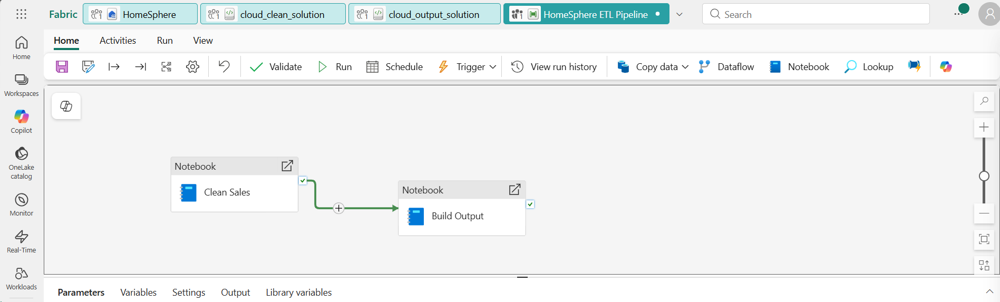
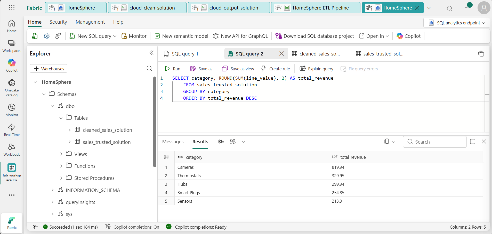

# Lab 2.6 ~ Orchestrate the HomeSphere ETL with a Pipeline

!!! abstract "S4: Automate data pipelines such as batch, real-time, on demand and other processes using programming languages and data integration platforms with graphical user interfaces."

!!! abstract "K8: Deployment approaches for new data pipelines and automated processes."

!!! info "This lab continues from where you left off. Your workspace and lakehouse from the earlier session should be still available."

## Step 1: Return to your HomeSphere workspace

1. In the navigation pane on the left, select **Workspaces** (the icon looks similar to &#128455;).

2. Select your `fab_workspace` to open it.

!!! tip "If your workspace is no longer available, you will need to repeat the setup steps from Lab 2.4 before continuing."


## Step 2: Attach the solution notebooks to the lakehouse

You imported four notebooks in the setup.

So far you have only used the exercise notebooks. In this lab **you will use the solution notebooks** to build your pipeline.

1. In the left navigation bar, return to your lakehouse `HomeSphere`.

2. At the top-right of the Lakehouse page, select the **Analyze data with** dropdown and choose: **Notebook** > **Existing notebook**

    !!! abstract ""
        

3. In the *OneLake catalog* under the heading **Open existing notebook**

    - Choose: `cloud_clean_solution`

3. In the **Notebook Explorer** on the left, select **Data Items** and confirm that **HomeSphere** appears under **OneLake**.

4. Return to the lakehouse and repeat for **cloud_output_solution**:

    - Select: **Notebook** > **Existing notebook** 
    - Choose: `cloud_output_solution`

5. Confirm that **HomeSphere** appears under **Data Items** in the Notebook Explorer.

!!! success "Both solution notebooks should now be connected to the HomeSphere lakehouse."


## Step 3: Create a pipeline

A pipeline lets you orchestrate the two notebooks so they run in sequence automatically, rather than being triggered manually one at a time.

1. In the left navigation bar, select your workspace name to return to the workspace view.

    !!! abstract ""
        

2. Select **New item**, then search for and select **Pipeline**.

3. Name the pipeline: `HomeSphere ETL Pipeline`

    !!! success "The pipeline designer canvas should open, ready for you to add activities."


## Step 4: Configure the pipeline activities

You will add two Notebook activities - one for each solution notebook - and connect them so that the output notebook only runs after the clean notebook has succeeded.

1. In the pipeline canvas: **Start with a blank canvas**:

    - Select: **Pipeline activity**
    - Choose: **Notebook** (scroll down - it should be under the *Transform* heading)

2. In the activity properties pane below the canvas, set the **Name** to: `Clean Sales Orders`

3. Select the **Settings** tab and configure the following:

    - **Workspace**: *select your workspace*
    - **Notebook**: select `cloud_clean_solution`

4. Add a second **Notebook** activity to the canvas.

5. In the properties pane, set the **Name** to: `Build Output`

6. Select the **Settings** tab and configure the following:

    - **Workspace**: *select your workspace*
    - **Notebook**: select `cloud_output_solution`

7. Connect the two activities

    - Hover over the **Clean Sales Orders** activity until a green arrow appears
    - Then drag the green arrow to the **Build Output** activity.

    !!! note "This creates an *On success* dependency"
        - **Build Output** will only run if **Clean Sales Orders** completes without errors.
        - This is what makes a pipeline more reliable than running notebooks by hand.

    !!! abstract ""
        


!!! note "Before running the pipeline - select the Monitor tab and make sure no other notebook is still running."


## Step 5: Run the pipeline

1. On the **Home** tab, use the :material-content-save: (*Save*) icon to save the pipeline.

2. Use the :material-play: **Run** button to run the pipeline.

3. Monitor the progress in the **Output** pane below the canvas.

    - Use the :material-refresh: (*Refresh*) icon to refresh the status.
    - Wait for both activities to show a green tick.

!!! success "Both activities should show as **Succeeded**."


## Step 6: Verify the results

The pipeline has run the same cleaning and output logic as the notebooks you ran manually earlier. You should now have two additional tables in your lakehouse.

1. In the left navigation bar, return to your **HomeSphere** lakehouse.

2. Select **Analyze data with** and choose **SQL analytics endpoint**.

3. Run the following queries to confirm the pipeline created the expected tables:

    ```sql
    SELECT COUNT(*) AS rows FROM cleaned_sales_solution
    ```

    Then run:

    ```sql
    SELECT category, ROUND(SUM(line_value), 2) AS total_revenue
    FROM sales_trusted_solution
    GROUP BY category
    ORDER BY total_revenue DESC
    ```

    !!! abstract ""
        

    !!! success "Both tables should exist and return results"
        - The pipeline cleaned the data and built the trusted output automatically.


---

In this exercise, you built a pipeline to orchestrate the HomeSphere ETL process automatically. Rather than running two notebooks by hand, a single pipeline run cleaned the data and built the trusted output in sequence.

!!! info "Keep your workspace"
    Don't delete anything - your workspace, lakehouse, and pipeline are all needed for the next lab.
