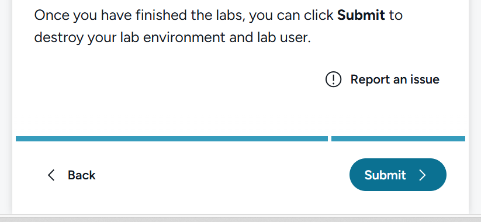

# Lab 2.9 ~ Rerun with a Hard Failure

!!! abstract "S8: Identify and troubleshoot issues with data processing pipelines."

!!! info "This lab continues from Lab 2.8. Your pipeline and all three sales files should still be in place."

So far, every rerun has ended in **Succeeded** - even when the output was wrong.
This time, the pipeline actually fails.

## Step 1: Add the fourth batch

1. Locate `sales_raw_batch29.csv` alongside your other HomeSphere data files.

2. Upload it into `Files/data/`, next to the other three files. Don't delete or
   rename anything.

## Step 2: Rerun the pipeline

1. Go to your **HomeSphere ETL Pipeline** and select **Run**.

2. Watch the two activities as they run, rather than only checking at the end.

## Step 3: Check the status

!!! question "Which activity failed - Clean Sales Orders, or Build Output? What does that tell you about whether the second activity ran at all?"

## Step 4: Find out why

1. Open the failed activity's error output from the pipeline run history.

2. Find the row in `sales_raw_batch29.csv` that caused it.

    !!! question "What's different about this row compared to every other row you've seen so far?"

## Step 5: Update your record

| Run          | Input                | Expected change | Raw rows | Cleaned rows | Output rows | Revenue | Status |
|--------------|-----------------------|------------------|----------|--------------|-------------|---------|--------|
| Fourth batch | sales_raw_batch29.csv | -                | -        | -            | -           | -       | Failed |

There's nothing to compare this time - the pipeline stopped before producing
anything new. `cleaned_sales_solution` and `sales_trusted_solution` still hold
whatever Lab 2.8 left behind.

!!! question "Across all four runs: which failure mode worried you the most - the row that silently vanished, the batch that silently vanished, or the pipeline that stopped outright? Why?"

---

## Clean up resources

In this exercise, you reran the same pipeline four times without changing it once. The pipeline told the truth about its own execution every time - and that still wasn't enough to tell you whether the output was right.

1. Navigate to Microsoft Fabric in your browser.

2. In the bar on the left, select the icon for your workspace to view all of the items it contains.

3. Select **Workspace settings** and in the **General** section, scroll down and select **Remove this workspace**.

4. Select **Delete** to delete the workspace.

5. Return to the QA Platform and click **Submit** to destroy the lab environment.

!!! abstract ""
    
